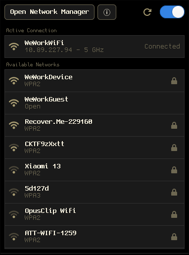

# ags-nm-panel

A Wi-Fi panel for NetworkManager on Hyprland and NixOS. Click your bar, pick a network.
A small standalone replacement for the nm-applet menu, built with
[AGS](https://aylur.github.io/ags/).



## What it does

- Lists each network once, saved ones first, then by signal.
- Joins open and saved networks in one click, and asks for the password
  inline for new ones.
- Shows what NetworkManager is doing: each connecting step, then the address
  and band once connected.
- Puts a failed attempt in a notice at the top, with NetworkManager's own
  reason, separate from your live connections.
- Offers Disconnect, Cancel, and Forget when you hover a row.
- Opens `nm-connection-editor` when you click an active connection, and
  nm-applet's Connection Information from the ⓘ button.
- Closes on Escape, a click outside, or a successful connection.

Hidden networks, VPN, and enterprise login are left to `nm-connection-editor`.

## Requirements

- NetworkManager
- Hyprland
- nm-applet installed, for `nm-connection-editor` and Connection
  Information. It does not need to be running.

## Install

### Nix

```nix
inputs.ags-nm-panel.url = "github:JDongian/ags-nm-panel";
```

Then add `inputs.ags-nm-panel.packages.${pkgs.system}.default` to your
packages.

### From source

You need AGS 3, Astal (`astal4`, `astal-io`), gjs, gtk4-layer-shell, libnm,
dart-sass, and jq.

```sh
ags bundle app.ts ags-nm-panel
install -Dm755 ags-nm-panel ~/.local/bin/ags-nm-panel
install -Dm755 connection-info.sh ~/.local/bin/ags-nm-panel-info
cp -r icons/hicolor ~/.local/share/icons/
```

## Use

Start it with your session. It stays hidden until toggled.

```
exec-once = ags-nm-panel
layerrule = no_anim on, match:namespace ags-nm-panel
```

`ags-nm-panel toggle` opens it under the cursor, so bind that to a bar button.

### Waybar

`waybar/network.sh` is a bar module to go with it. It shows signal strength,
and three icons while connecting: reaching out, negotiating, getting an
address. It needs `nmcli`, `jq`, and a Nerd Font.

```jsonc
"custom/network": {
    "exec": "/path/to/waybar/network.sh",
    "return-type": "json",
    "restart-interval": 5,
    "on-click": "ags-nm-panel toggle"
}
```

## Passwords

The panel hands the password to NetworkManager over D-Bus. It never appears
on a command line or in a log. NetworkManager stores it in a system
connection profile, which only root can read. There is no keyring and no
secret agent. The field is hidden while you type, with a toggle to reveal it.

## Theme

The eight colours are variables at the top of `src/style.scss`. The font is
whatever GTK is set to.

## Credits

The layout follows the network dropdown in
[wayle](https://github.com/wayle-rs/wayle) by Jas Singh.

## License

Copyright (C) 2026 Joshua Dong. Released under the [WTFPL](LICENSE). The built
program bundles the AGS runtime, which is GPL-3.0.
